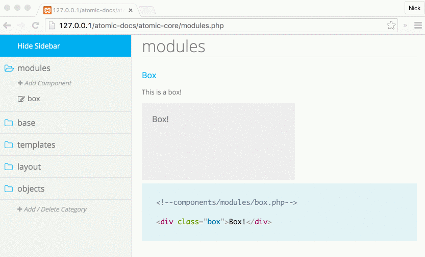

# Responsive web 2 - Sandra Filipsson - Tenta 22/9 2016

### Git repository for examination in course Responsive webdesign on date 2016-09-22.

## How to start the project:

1. Navigate to atomic-docs-master, write code below inside the terminal
```shell
npm install
```
2. Navigate to atomic-docs-master/atomic-core, write code below inside the terminal
```shell
npm install
```
3. Start Mamp or simular 

### If you have a PC:
4. Dubbleclick the program 'start-atomic.bat'
5. The styleguide will display in your browser
6. To display the index-page navigate to 'http://127.0.0.1/atomic-docs-master'

### or if you have a Mac: 
4. Open the terminal, navigate to folder 'atomic-docs-master' and write code below within the terminal
```shell
gulp
```
5. Open your browser and write in 'http://127.0.0.1/atomic-docs-master/atomic-core'
6. The styleguide will display in your browser
7. To display the index-page navigate to 'http://127.0.0.1/atomic-docs-master'

## TESTING with Visual Regression Testing

1. Navigate to 'atomic-docs-master/node_modules/backstopjs' 
2. Print code below in the terminal (this will generate a folder with printscreens for reference)
```shell
npm run reference
```
3. Print code below in the terminal (this will start your browser and show you the differences from reference to test)
```shell
npm run test
```
## TESTING with Gulp-Louis
1. Navigate to 'atomic-docs-master'
2. Print code below in the terminal
```shell
gulp-louis
```
3. Result will show in the terminal

## Atomic Docs - how to guide (not necessary for this project)

Atomic Docs is a front end style guide generator and component manager. Atomic Docs is built in PHP and Sass. Inspired by Brad Frost's Atomic Design principles.

Atomic Docs works with Sass, Less and Stylus.

Documentation can be found at <a href="http://atomicdocs.io/">AtomicDocs.io</a>.


## Set up

1. Download Atomic Docs and add to your local PHP environment.
2. Configure your preprocessor to output `scss/main.scss` to `css/main.css`.
3. Go to `http://localhost/atomic-docs/atomic-core/index.php` and get started.

##Document
Have full documentation to hand off to other teams, internal or external.


##Organize
Organize all your components under categories that you name. "Base", "Modules", "Atoms" etc...


##Manage
Manage all your components. Move, rename and delete with a clean GUI interface.



##Save time
Does all the "wiring" of your SCSS partials. Never write `@import "partial-name";` again.


Documentation can be found at <a href="http://atomicdocs.io/">AtomicDocs.io</a>.

##Join the conversation!
We'd love to hear your thoughts and suggestions. Join us on <a href="https://nick578.typeform.com/to/NwX0ox">Slack</a>.


